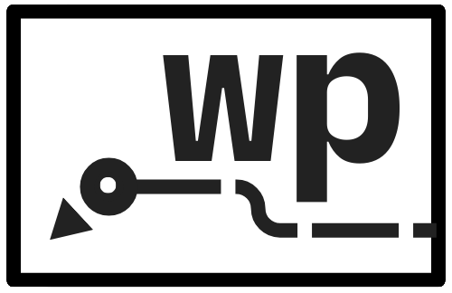

<div align="center">
  
  
  # WikiPigeon

  A simple Wikiracing performance visualiser and tracker written in Python.
</div>

## What is Wikiracing?

Wikiracing is when users race each other to get from one Wikipedia article (Starting page) to another (Target page) using only the internal redirect links inside Wikipedia articles.

<div align="center">
  
  
  
</div>

WikiPigeon allows you to assess your Wikiracing skills by tracking how many pages it took for you to reach your target page, how much time you spent on each page, how many times you needed to backtrack, and so much more! 

## Installation

Either compile ```main.py``` as an executable or navigate to ```dist\main.exe``` to download and run ```main.exe```.

## Usage Guide

1. Launch WikiPigeon.

2. Open a Wikipedia article in any supported browser. WikiPigeon will automatically detect the article and immediately activate the stopwatch, scorekeeper, and visualiser.

3. Do a Wikirace or browse through Wikipedia using internal article links. Wikipigeon will automatically keep track of what articles you visit, how long you spend on each article, and your performance score (if you're doing a Wikirace).

4. When you've reached your target article or are done browsing, simply press the "End" button at the top of the screen to end the Wikirace/browsing and view your performance. When you'd like to start over, simply press the "Reset" button at the bottom of the screen to reset.

## Wikiracing in WikiPigeon

Wikiracing has many house rules depending on the platform you play it on. WikiPigeon offers its own spin on Wikiracing scoring as well as its own simple anti-cheat system.

### Anti-Cheat

Nodes in the visual timeline can either be green or red. Green indicates that WikiPigeon can confirm the article opened can be found as a redirect link in the previous article. If the node is red, it means that either WikiPigeon could not confirm it was present in the previous article and requires human verification, or that it is indeed not present there at all.

### Scoring System

In WikiPigeon, lowest score wins. The scoring system works as follows:
<table>
  <tr>
    <th>Points</th>
    <th>Condition</th>
  </tr>
  <tr>
    <td>+10 PP</td>
    <td>For every 60 seconds that elapses</td>
  </tr>
  <tr>
    <td>+5 PP</td>
    <td>For every Backtrack</td>
  </tr>
  <tr>
    <td>+2 PP</td>
    <td>For every new Page visited</td>
  </tr>
</table>

## System Info
Tested browsers: Google Chrome / Opera / Opera GX


